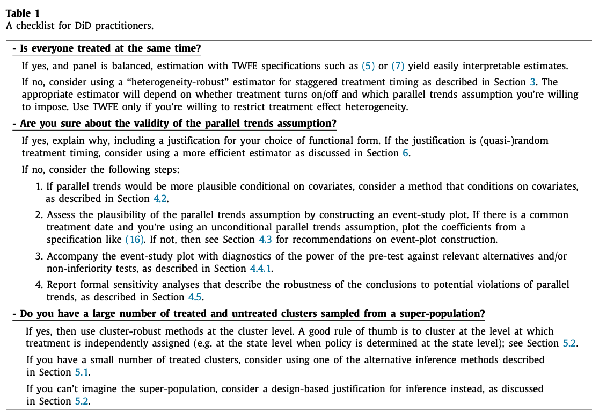

  

I have done a lot of work on difference-in-differences (DiD), and have tried to make as many resources as possible available online. This page collects links to those resources.

## DiD Course

I have been teaching a one-day course on recent DiD methods for Mixtape Sessions. All of my teaching material is available on [Github](https://github.com/Mixtape-Sessions/Advanced-DID). 

This includes ***slides*** for three lectures -- feel free to use in these in your teaching (with proper attritubution): 

* **Introduction** ([pdf](https://github.com/Mixtape-Sessions/Advanced-DID/blob/main/Slides/01-introduction.pdf) [latex](https://github.com/Mixtape-Sessions/Advanced-DID/blob/main/Slides/01-Introduction.tex)): covers the canonical two-period DiD model and summarizes how recent papers have deviated from the canonical model 

* **Staggered treatment** ([pdf](https://github.com/Mixtape-Sessions/Advanced-DID/blob/main/Slides/02-staggered.pdf) [tex](https://github.com/Mixtape-Sessions/Advanced-DID/blob/main/Slides/02-Staggered.tex)): covers (some of the) recent innovations in DiD with staggered treatment timing

* **Violations of parallel trends** ([pdf](https://github.com/Mixtape-Sessions/Advanced-DID/blob/main/Slides/03-violations.pdf) [tex](https://github.com/Mixtape-Sessions/Advanced-DID/blob/main/Slides/03-Violations.tex)): covers recent work on limitations of pre-trends testing and alternative approaches when parallel trends might be violated, with a focus on [Roth (2022, AERI, "Pre-test with Caution...'')](https://www.jonathandroth.com/assets/files/roth_pretrends_testing.pdf) and [Rambachan and Roth (2023, RESTUD, "A More Credible Approach...")](https://www.jonathandroth.com/assets/files/HonestParallelTrends_Main.pdf)

There are also two ***coding exercises*** that show how these methods can be used in practice:

* **Staggered timing coding exercise**: [Instructions](https://github.com/Mixtape-Sessions/Advanced-DID/tree/main/Exercises/Exercise-1#introduction) [R solutions](https://github.com/Mixtape-Sessions/Advanced-DID/blob/main/Exercises/Exercise-1/Solutions/medicaid-analysis-solutions-R.md) [Stata solutions](https://raw.githack.com/Mixtape-Sessions/Advanced-DID/main/Exercises/Exercise-1/Solutions/medicaid-analysis-solutions-stata.html)

* **Violations of PT coding exercise**: [Instructions](https://github.com/Mixtape-Sessions/Advanced-DID/tree/main/Exercises/Exercise-2#exercise-2-violations-of-parallel-trends) [R solutions](https://raw.githack.com/Mixtape-Sessions/Advanced-DID/main/Exercises/Exercise-2/Solutions/medicaid-analysis-pt-violations-solutions-R.html) [Stata solutions](https://raw.githack.com/Mixtape-Sessions/Advanced-DID/main/Exercises/Exercise-2/Solutions/medicaid-analysis-pt-violations-solutions-stata.html)

If you like this material, you can see when I'm next teaching the course and sign up [here](https://www.mixtapesessions.io/sessions/). 

## DiD Review Paper

For a more detailed review of the recent literature, see my Journal of Econometrics [paper](https://www.jonathandroth.com/assets/files/DiD_Review_Paper.pdf), "What's trending in difference-in-differences? A synthesis of the recent econometrics literature". You may be especially interested in Table 1, which provides a checklist for practitioners.

Also be sure to check out Table 2, which provides a list of packages for DiD methods, based on Asjad Naqvi's excellent [website](https://asjadnaqvi.github.io/DiD/).

## Packages

I am the co-creator of several packages for DiD methods. Click on the links below and check out the package READMEs for instructions. 

* **HonestDiD** ([R](https://github.com/asheshrambachan/HonestDiD/tree/master#honestdid) [Stata](https://github.com/mcaceresb/stata-honestdid#honestdid)): robust inference and sensitivity analysis tools for DiD when parallel trends may be violated, based on [Rambachan and Roth (2023)](https://www.jonathandroth.com/assets/files/HonestParallelTrends_Main.pdf)

* **staggered** ([R](https://github.com/jonathandroth/staggered/tree/main#staggered) [Stata](https://github.com/mcaceresb/stata-staggered#staggered)): Implements the efficient estimator for settings with (quasi-)random treatment timing proposed in [Roth and Sant'Anna (2023, JPE:Micro)](https://arxiv.org/pdf/2102.01291.pdf). Also implements Callaway & Sant'Anna and Sun & Abraham estimators (without covariates).

* **pretrends** ([R](https://github.com/jonathandroth/pretrends) [Stata](https://github.com/mcaceresb/stata-pretrends#pretrends) [Shiny](https://github.com/jonathandroth/PretrendsPower#pretrendspower)): implements power calculations for pre-trends tests following [Roth (2022, AERI)](https://www.jonathandroth.com/assets/files/roth_pretrends_testing.pdf)

 
 
